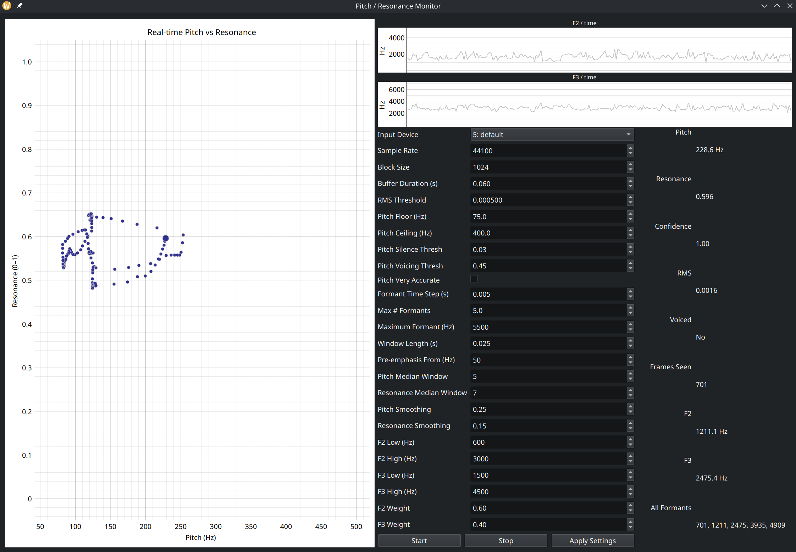

# speedy-voice-space
Real-time pitch and formant/resonance tracking, with praat, noise reduction, normalization, and 2D plots

## Install

```bash
python3 -m venv .venv
source .venv/bin/activate
pip install -r requirements.txt
````

## Run

```bash
python3 ui.py
```


## UI Example



## Notes:
- Not all audio devices will work, try a variety of devices to determine what is functional and is best.
- Fairly sensitive to noise. Use in a quiet, private environment.
- If your space is noisy, you can increase median ranges, or reduce exp decay params.
- Tune RMS cutoff based on your room's noise level
- Speak close to the microphone
- Higher window lengths will be less responsive but more accurate.

## TODO:
- Background noise reduction
- Better defaults
